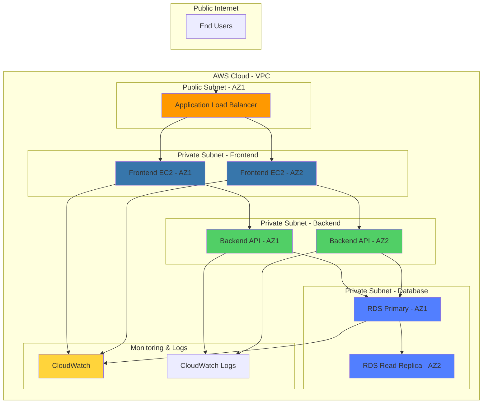
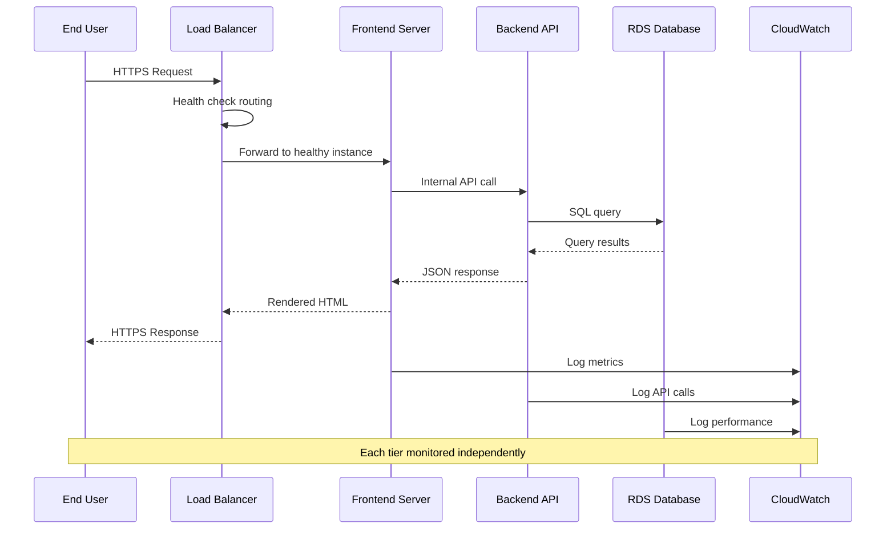
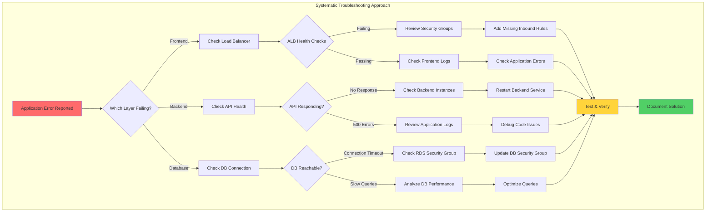
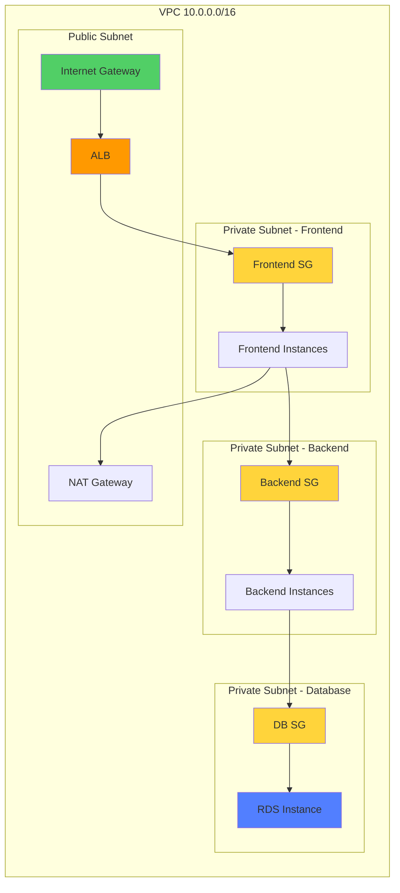
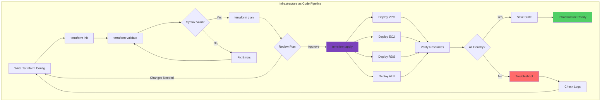
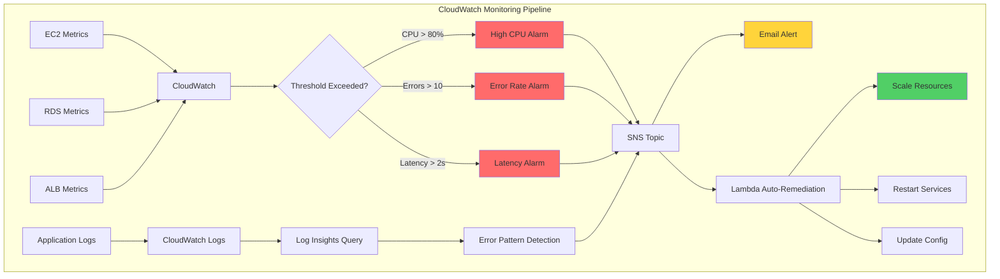

# Multi-Tier App Troubleshooting Playground

[](https://aws.amazon.com/)
[](https://www.terraform.io/)
[](https://www.python.org/)
[](https://aws.amazon.com/cloudformation/)
[](LICENSE)

> Learning project exploring multi-tier application architecture and troubleshooting workflows on AWS.

---

## 📋 About This Project

A hands-on learning project where I designed and documented a multi-tier application architecture to understand how frontend, backend, and database layers interact. This demonstrates systematic troubleshooting approaches and infrastructure design concepts relevant to Cloud Support and DevOps roles.

**Built for:** Learning multi-tier architecture patterns and developing troubleshooting methodologies for Cloud Support Engineer positions.

---

## 🎯 Skills Practiced

| Area | Technologies |
|------|--------------|
| **Architecture Design** | Three-tier application pattern (Frontend, Backend, Database) |
| **Infrastructure as Code** | Terraform (85.2%), CloudFormation |
| **Compute** | EC2 instances, Auto Scaling Groups |
| **Load Balancing** | Application Load Balancer, Network Load Balancer |
| **Networking** | VPC, subnets, security groups, route tables |
| **Database** | RDS MySQL/PostgreSQL, read replicas |
| **Monitoring** | CloudWatch logs, metrics, alarms |
| **Troubleshooting** | Systematic diagnostic workflows |

---

## 🏗️ System Architecture

### Complete Multi-Tier Design



---

### Application Request Flow



---

### Troubleshooting Decision Tree



---

### Network Architecture & Security



---

### Terraform Deployment Workflow



---

### Monitoring & Alerting Flow



---

## 📸 Learning Documentation

### Application Workflow Screenshots

<details>
<summary>📋 View Complete User Journey</summary>

**Step 1: User Login Interface**

*Login page demonstrating frontend authentication flow*

---

**Step 2: Main Dashboard**

*Dashboard showing successful frontend-backend integration*

---

**Step 3: Error Logs View**

*Error log interface for troubleshooting application issues*

---

**Step 4: API Response Testing**

*Backend API response validation*

---

**Step 5: Admin Authentication**

*Administrative access with elevated permissions*

---

**Step 6-7: Admin Error Log Analysis**

*Detailed error log review from admin perspective*


*Aggregated error log analysis*

---

**Step 8: Admin API Validation**

*API response verification with admin privileges*

---

**Step 9: Secondary User Flow**

*Testing multi-user scenarios*

---

**Step 10: Secondary Dashboard**

*User-specific dashboard rendering*

---

**Step 11: Secondary Error Logs**

*Error logging from different user context*

---

**Step 12: Secondary API Response**

*API behavior with secondary user credentials*

---

**Step 13: Tertiary User Testing**

*Additional user scenario validation*

---

**Step 14: Tertiary Dashboard**

*Dashboard consistency across users*

---

**Step 15: Tertiary Error Logs**

*Error tracking across multiple user sessions*

---

**Step 16: Tertiary API Response**

*API consistency validation*

---

**Step 17: Final Test Authentication**

*Comprehensive testing completion*

</details>

---

## 📁 Project Structure

```
Multi-Tier-App-Troubleshooting-Playground/
├── terraform/              # Infrastructure as Code
│   ├── vpc.tf             # VPC and networking
│   ├── ec2.tf             # Frontend and backend instances
│   ├── rds.tf             # Database configuration
│   ├── alb.tf             # Load balancer setup
│   └── security_groups.tf # Security rules
├── backend/                # Backend API code
├── frontend/               # Frontend application
├── database/               # Database schemas
├── diagrams/               # Architecture diagrams
│   └── Architecture diagram.png
├── scenarios/              # Troubleshooting scenarios
├── screenshots/            # Documentation (17 images)
├── scripts/                # Automation scripts
├── monitoring/             # CloudWatch configurations
├── workflows/              # CI/CD workflows
├── main.tf                 # Root Terraform config
├── outputs.tf              # Terraform outputs
└── README.md               # This file
```

---

## 🚀 Getting Started

### Prerequisites

- AWS Account (Free Tier eligible)
- Terraform 1.0+
- AWS CLI configured
- Python 3.8+ (for backend)

### Deployment Steps

```bash
# Clone repository
git clone https://github.com/charles-bucher/Multi-Tier-App-Troubleshooting-Playground.git
cd Multi-Tier-App-Troubleshooting-Playground

# Initialize Terraform
cd terraform
terraform init

# Review infrastructure plan
terraform plan

# Deploy infrastructure
terraform apply

# Get outputs
terraform output
```

### Access the Application

```bash
# Get Load Balancer DNS
terraform output alb_dns_name

# Open in browser
http://<alb_dns_name>
```

---

## 📚 What I Learned

### Architecture Concepts
- **Three-tier design pattern**: Separation of frontend, backend, and database
- **High availability**: Multi-AZ deployment for redundancy
- **Load balancing**: Distributing traffic across instances
- **Security layers**: Network segmentation with security groups

### AWS Services
- **EC2**: Instance types, Auto Scaling Groups, placement
- **VPC**: Subnets, route tables, Internet Gateway, NAT Gateway
- **ELB**: Application Load Balancer configuration and health checks
- **RDS**: Managed database, read replicas, backup strategies
- **CloudWatch**: Metrics collection, log aggregation, alarms

### Troubleshooting Methodology
- **Systematic approach**: Layer-by-layer diagnosis
- **Log analysis**: Reading CloudWatch logs for error patterns
- **Network debugging**: Security group rules, route table validation
- **Performance tuning**: Identifying bottlenecks

### Infrastructure as Code
- **Terraform modules**: Reusable infrastructure components
- **State management**: Remote state with S3
- **Resource dependencies**: Proper ordering of resource creation
- **Variable management**: Parameterized configurations

---

## 🎯 Next Steps

**Planned Improvements:**
- [ ] Add auto-scaling policies based on CPU/memory
- [ ] Implement CI/CD pipeline with GitHub Actions
- [ ] Add WAF rules for security
- [ ] Create disaster recovery runbook
- [ ] Add comprehensive monitoring dashboards
- [ ] Implement blue-green deployment strategy

---

## 💼 Skills for Job Applications

This project demonstrates understanding of:

**Cloud Support Engineer:**
- Multi-tier application architecture
- Systematic troubleshooting approaches
- AWS service integration
- Log analysis and debugging

**DevOps Engineer:**
- Infrastructure as Code (Terraform 85.2% of codebase)
- Automated deployment workflows
- Monitoring and alerting setup
- High availability design

**Solutions Architect:**
- Three-tier architecture design
- Security best practices
- Scalability planning
- Cost optimization considerations

---

## 📧 Contact

**Charles Bucher**  
📍 Pinellas Park, Florida  
✉️ quietopscb@gmail.com  
🔗 [GitHub](https://github.com/charles-bucher) • [LinkedIn](https://linkedin.com/in/charles-bucher-cloud)

Currently building cloud infrastructure skills and seeking Cloud Support Engineer or Junior DevOps opportunities.

---

## 📝 License

This project is licensed under the MIT License - see the [LICENSE](LICENSE) file for details.

---

## 🙏 Learning Resources

Built while learning from:
- AWS Well-Architected Framework
- Terraform AWS Provider Documentation
- Multi-tier application design patterns
- Cloud troubleshooting best practices

---

**Keywords for ATS:** AWS, Multi-Tier Architecture, Terraform, Infrastructure as Code, EC2, VPC, RDS, Load Balancer, CloudWatch, Troubleshooting, DevOps, Cloud Support, Three-Tier Application, High Availability, Auto Scaling, Security Groups, CloudFormation, Python, Monitoring, Incident Response