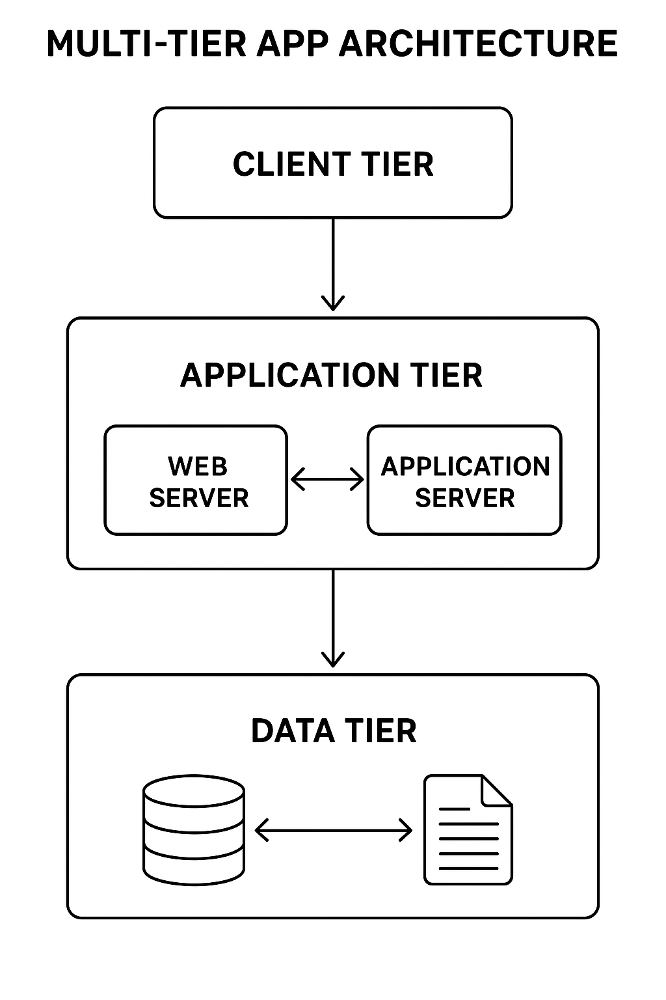
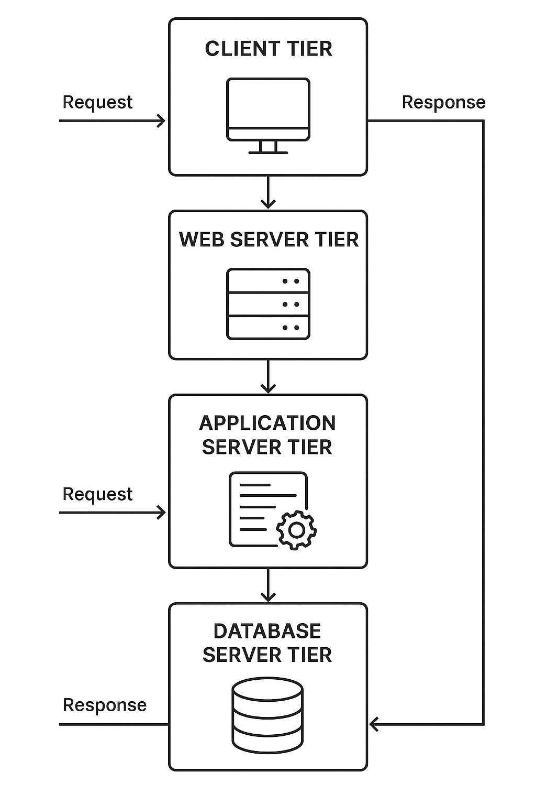

# Push-README-Update.ps1
# Updates README.md with corrected image paths and pushes to GitHub

$readmeContent = @'
# Multi-Tier App Troubleshooting Playground 🛠️

## 👋 About This Project

Hands-on AWS lab simulating real-world CloudOps troubleshooting scenarios. Built to practice deploying, monitoring, and fixing multi-tier web applications in a controlled environment before touching production systems.

**What this demonstrates:**
- Deploying multi-tier AWS infrastructure (web, app, database layers)
- Simulating realistic operational failures and troubleshooting them
- Building monitoring pipelines and automated alerts
- Documenting incident response workflows

This isn't production infrastructure—it's a safe training ground for building CloudOps muscle memory.

---

## 🏗️ Architecture



**Components:**
- **Frontend:** EC2 instances serving web tier
- **Backend:** EC2 instances running application logic
- **Database:** RDS instance for data persistence
- **Networking:** VPC with public/private subnets, security groups, routing tables
- **Load Balancing:** ELB distributing traffic across frontend instances
- **Monitoring:** CloudWatch dashboards, alarms, and logs



---

## 📂 Project Structure

```
Multi-Tier-App-Troubleshooting-Playground/
├── backend/          # Application tier code and configs
├── frontend/         # Web tier code and configs
├── database/         # Database initialization scripts
├── diagrams/         # Architecture diagrams
├── docs/             # Troubleshooting scenarios and playbooks
├── screenshots/      # Lab walkthrough screenshots
├── workflows/        # CI/CD automation
├── main.tf           # Terraform infrastructure deployment
├── outputs.tf        # Terraform outputs
├── variables.tf      # Terraform configuration variables
└── README.md
```

---

## 🚀 Quick Start

### 1. Deploy Infrastructure

```bash
terraform init
terraform plan
terraform apply
```

**Result:** Full multi-tier environment deployed (EC2, RDS, VPC, subnets, load balancer)

### 2. Verify Connectivity

- Test EC2 SSH access
- Verify security group rules
- Confirm routing table configurations
- Test IAM role permissions

**Result:** Baseline operational state confirmed

### 3. Launch Application

- Start frontend services on web tier EC2 instances
- Start backend services on app tier EC2 instances
- Verify database connectivity from app tier

**Result:** Working multi-tier application

### 4. Run Troubleshooting Scenarios

Simulated failures include:
- **EC2 instance failure:** Instance stops responding, need to diagnose and recover
- **IAM permission errors:** App can't access RDS due to misconfigured roles
- **Database connection failures:** RDS security groups blocking app tier access
- **Load balancer health check failures:** ELB marking instances unhealthy
- **Network routing issues:** Subnet routing tables misconfigured

Each scenario includes:
- Problem description
- Symptoms and error messages
- Troubleshooting steps
- Root cause analysis
- Resolution documentation

**Result:** Hands-on experience diagnosing and fixing real-world AWS issues

### 5. Monitoring & Automation

- CloudWatch dashboards tracking key metrics
- Automated alerts via SNS for threshold breaches
- CI/CD workflows for infrastructure deployment
- Python scripts for health checks and validation

**Result:** Operational observability and automation practice

---

## 💻 Skills Demonstrated

| Area | Tools & Technologies |
|------|---------------------|
| **Cloud Infrastructure** | AWS EC2, VPC, ELB, RDS, IAM, S3 |
| **Infrastructure as Code** | Terraform, CloudFormation |
| **Monitoring & Logging** | CloudWatch (dashboards, alarms, logs, metrics) |
| **Automation** | Python scripting, Lambda functions, SNS alerts |
| **Troubleshooting** | Incident simulation, root cause analysis, documentation |
| **DevOps** | CI/CD workflows, GitHub Actions |

---

## 🎯 Learning Outcomes

- Deploy and configure multi-tier AWS applications
- Troubleshoot common operational failures (networking, IAM, database connectivity)
- Build monitoring dashboards and configure automated alerts
- Document incident response procedures
- Practice systematic problem-solving under simulated pressure
- Create portfolio-ready demonstrations of CloudOps skills

---

## 📸 Lab Walkthrough

### Login & Authentication


### Dashboard & Monitoring


### Error Logs & Troubleshooting


### API Testing & Responses


### Architecture Documentation


---

## 📬 Contact

**GitHub:** [charles-bucher](https://github.com/charles-bucher)  
**Portfolio:** [charles-bucher.github.io](https://charles-bucher.github.io)  
**LinkedIn:** [Charles Bucher](https://linkedin.com/in/charles-bucher-cloud)  
**Email:** quietopscb@gmail.com

---

## 📄 License

MIT License - see [LICENSE](LICENSE) file for details

---

**About:** Hands-on AWS CloudOps lab simulating multi-tier web application deployment, monitoring, and troubleshooting. Focused on incident response, operational excellence, and building real-world cloud support skills in a safe training environment.
'@

# Write new README content
Write-Host "Updating README.md with corrected image paths..." -ForegroundColor Cyan
Set-Content -Path "README.md" -Value $readmeContent -Encoding UTF8

# Git operations
Write-Host "Staging changes..." -ForegroundColor Cyan
git add README.md

Write-Host "Committing changes..." -ForegroundColor Cyan
git commit -m "Fix image paths: uppercase PNG for diagrams, lowercase png for screenshots"

Write-Host "Pushing to GitHub..." -ForegroundColor Cyan
git push origin main

Write-Host "Done! All images should now display correctly on GitHub." -ForegroundColor Green